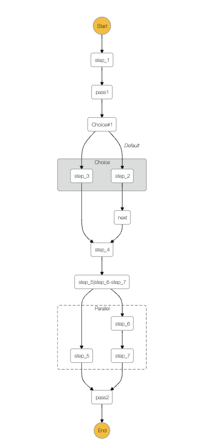

# AirFunctions

`AirFunctions` is a Python framework that brings Airflow-like workflow orchestration to AWS Step Functions. It provides an intuitive Python API for building, testing, and deploying complex state machines while maintaining the reliability and scalability of AWS Step Functions.

## Features

- **Airflow-like Python API**: Write AWS Step Functions workflows using familiar Python syntax
- **Local Testing**: Test your workflows locally before deployment
- **Easy Composition**: Build complex state machines using simple operators like `>>` and conditional logic
- **Fast Deployment**: Streamlined deployment process using Terraform
- **Lambda Integration**: Seamless integration with AWS Lambda functions

## Quick Start

```python
from airfunctions.bundle import Config, TerraformBundler
from airfunctions.steps import Choice, Pass, lambda_task

# Define your Lambda tasks
@lambda_task
def step_1(event, context):
    return event


@lambda_task
def step_2(event, context):
    return event

# ...

@lambda_task
def step_7(event, context):
    return event

# Create workflows using familiar operators
condition_1 = (step_1.output("a") == 10) | (step_1.output("b") == 20)
workflow_1 = (
    step_1
    >> Pass("pass1")
    >> Choice("Choice#1", default=step_2).choose(condition_1, step_3)
)
workflow_1 = workflow_1["Choice#1"].choice() >> Pass("next")
workflow_2 = (
    step_4
    >> [
        step_5,
        step_6 >> step_7,
    ]
    >> Pass("pass2", input_path="$[0]", result={"output.$": "$.a"})
)
workflow_final = workflow_1 >> workflow_2

```

## Test
```python
assert {'output': 10} == workflow_final({"a": 10}, None)
```
## Generate definition
```python
print(workflow_final.definition)
```
## Deploy
```python
# Deploy to AWS Step Functions
# Configure and deploy using Terraform
workflow_final.to_statemachine("my-workflow")
Config().resource_prefix = "my-project-"
bundler = TerraformBundler()
bundler.validate()
bundler.apply()
```


## Key Concepts

- **Lambda Tasks**: Decorate your Python functions with `@lambda_task` to convert them into AWS Lambda functions
- **Flow Operators**: Use `>>` to chain steps together
- **Conditional Logic**: Build branching workflows using `Choice` steps
- **Parallel Execution**: Run steps in parallel using list syntax
- **State Management**: Access task outputs using the `.output()` method
- **Local Testing**: [States language](https://states-language.net) was reproduced in [python logic](./airfunctions/jsonata.py) to enable testing locally 

## Installation

```bash
pip install airfunctions
```
